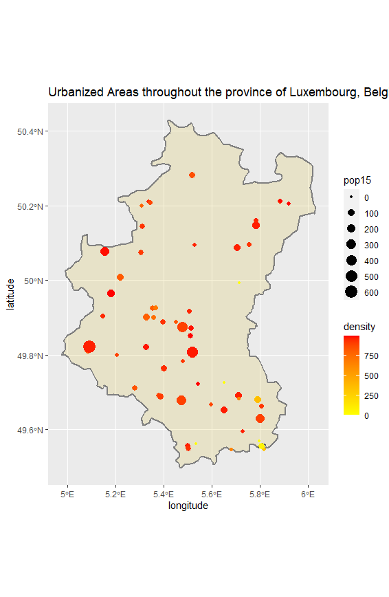
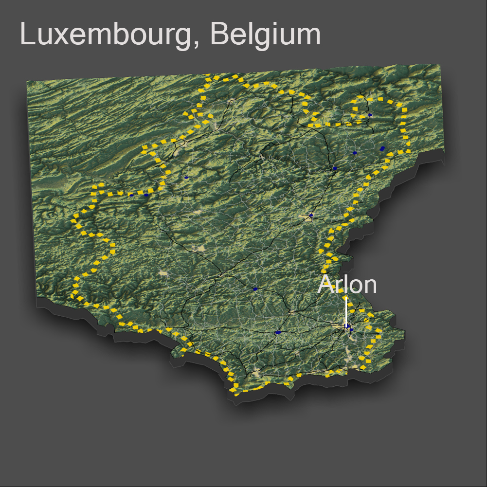

# Accessibility 1

This plot shows the population densities according to the size and color of the dots. The urban areas can be slightly seen behind the dots, but because the area is so small compared to the dots it can be hard to see; it can be seen somewhat in the middle yellow points.
# Accessibility 2

# Accessibility 3

