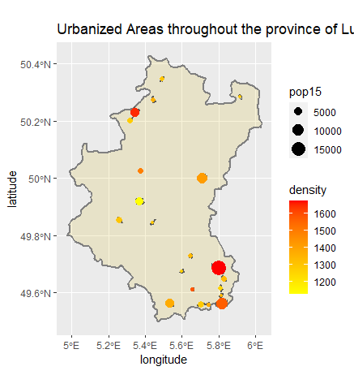

# Accessibility 1

This plot shows the population densities according to the size and color of the dots. The urban areas can be slightly seen behind the dots, but because the area is so small compared to the dots it can be hard to see; it can be seen somewhat in the middle yellow points.
# Accessibility 2

There are 21 distinct populous areas, with a total population of 85,291 people. There is a large amount of populous areas located near the south east border of Luxembourg, with other 'small' settlements in central and north Luxembourg. There is also a single large populous area in the east at around 50 degrees latitude. Highways connect to each city in Luxembourg, with roads branching through each highway. Health centers, hospitals especially, show up at cities or other highly-populous areas. It seems healthcare is easily accessable across Luxembourg, given the large concentration of roads branching to everywhere and the multiple hospitals around Luxembourg and its cities. 
# Accessibility 3

