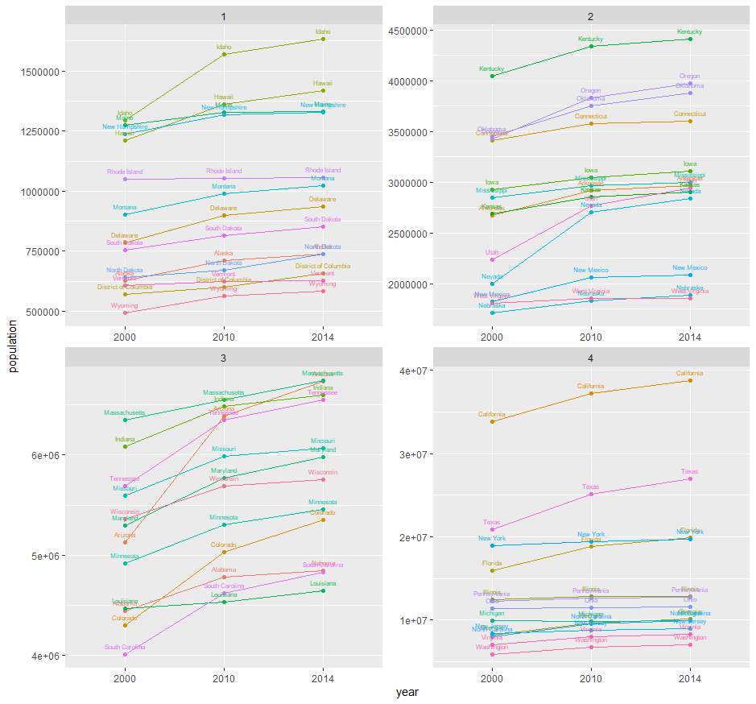

# Project 1 - Part 1

### Colleges with Four Year Degrees by Region

### Colleges with Doctorate Degrees by Region

Overall I found this to be a little difficult to understand, especially once the more complicated graphs and overlays came into play. I feel that personally I didn't fully understand some of the ggplot commands or what they did, but I hope that with the completion of part 2 and future projects I will be able to fully understand the ggplot and its commands. 
# Project 1 - Part 2

The second part of the project I found was easier, mainly as all of the code was avaliable to copy so it went by faster. I did run into a few issues though, which I'll explain here. The first issue I ran into was that my data seemed to have many extremes, which I solved by ordering the data before I grouped the data into a single data frame, which corrected any state-mismatches. Next I found that in the year 2000 Puerto Rico wasn't deleting and instead Wyoming was. I fixed this by deleting a line of code that I had accidentally left in. Finally I had an issue where my graph seemed to not work even with what I changed, so I cleared the console (control + L) and then ran each command line by line to find the issue, and for some reason that worked and the graphs became good again, even though I didn't change any code. Overall I'm able to understand each line of code pretty well, which allows me to fine comb my mistakes and correct them. 
