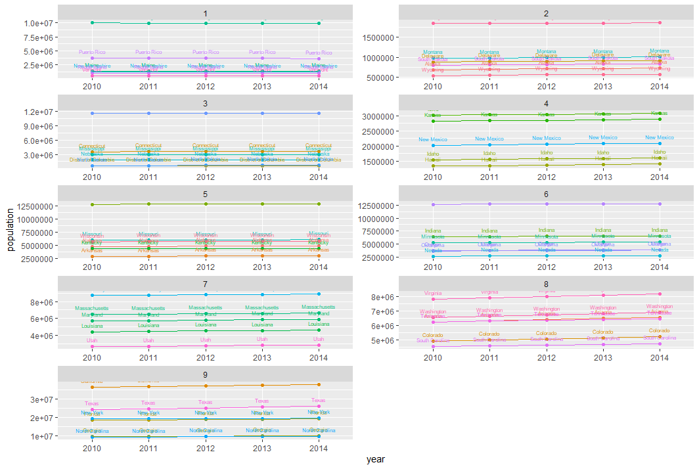
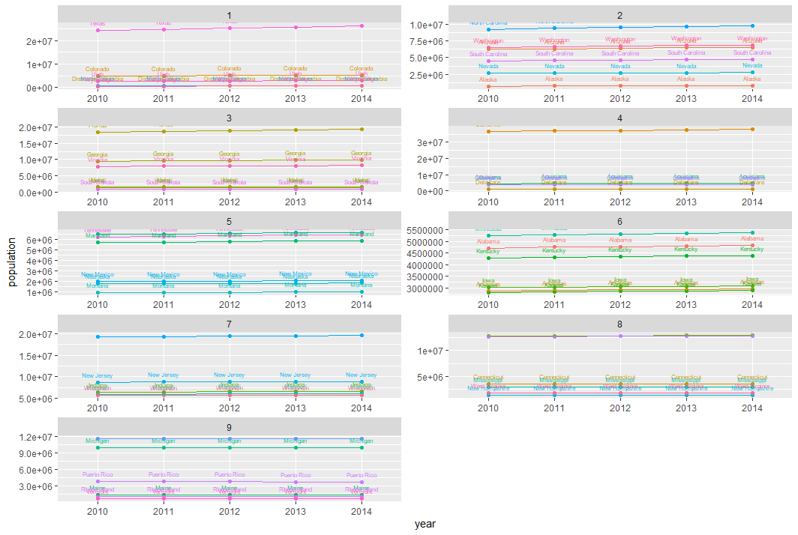

# Project 2 Part 1

The following data is collected from the US census data. - https://api.census.gov/data/

This graph shows the annual populations of each state from 2010 to 2014. The graph is split into 9 different sections in order for easier viewing of each state. Graphs 1, 2, 3,  5, and 6 have state outliers that far surpass other state populations, while the rest of the graphs are relatively uniform in population differences. 

This graph shows the annual population increases averaged for each state, meaning each state's population growth or decline is linear. It is also split into 9 different graphs for easier viewing of each individual state. Plots 1, 4, 7, and 8 all show significant growth in the outlier state. 
