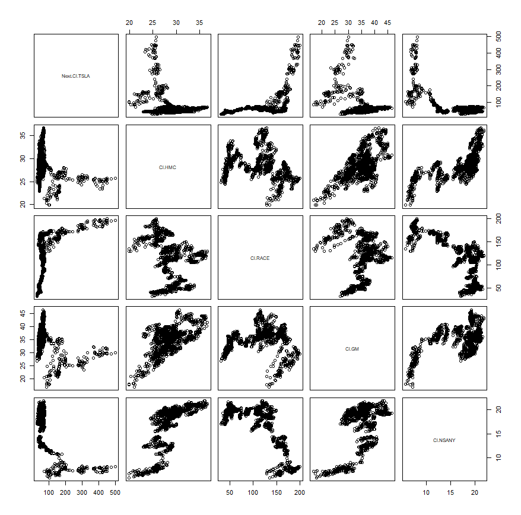
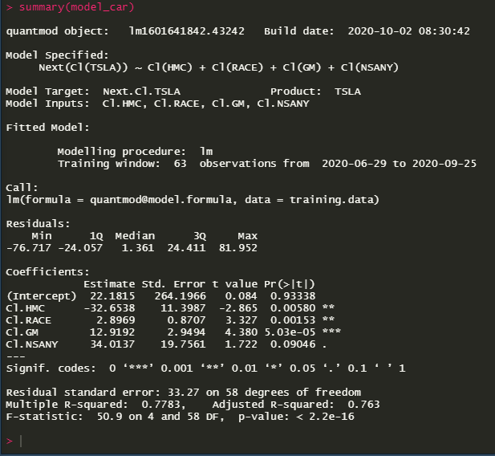

### Deilverable 1

This plot shows the stocks of 5 companies correlates with each other from June 28th, 2020 to September 27th, 2020. The stocks used, from top left to bottom right, are Tesla, Honda Motor Co, Ferrari, General Motors, and Nissan Motor Co Ltd.
There does not seem to be many positive correlations, and much of the data doesn't seem to have a high r value. 

### Deliverable 2

This is a summary of the predictor stock Telsa and the predictive stocks Honda Motor Co, Ferrari, General Motors, and Nissan Motor Co Ltd.
