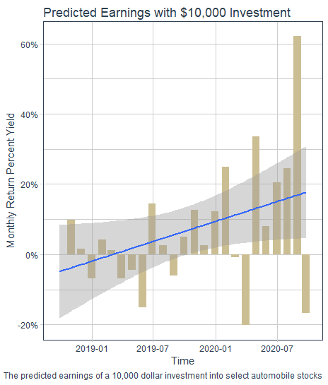
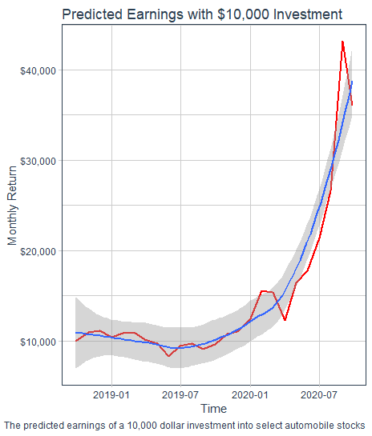

## Part 3

This graph shows the percentage yield predicted from the stocks of Tesla, Honda Motor Co, Ferrari, General Motors, and Nissan. It predicts an average growth of 20%, with it reaching over 60% earnings. 

This graph clearly shows the massive gains that could've been has with investing into the automotive industry (mainly Tesla), with 40,000 dollars possible of being earned from an initial $10,000 investment. By investing solely in Tesla stock, this jumps to $75,000+.
