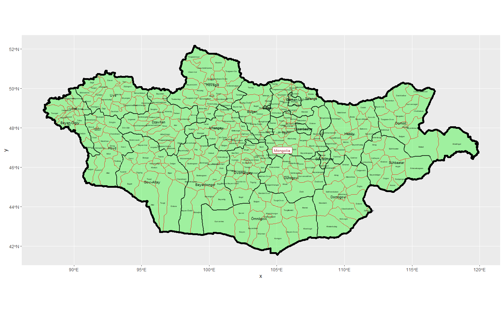

# Project 1

### Team Challenge Question 1

This part went fine and I understood all of it pretty easily. This map shows all the provinces and sub provinces of Mongolia, I chose this map as I lived there for a time when I was quite young. 

### Stretch Goal 2

I had a little problem with this as I had set my alpha to 1 so I couldn't see the subdivisions of the province, but I figured it out. 
This map shows the most populous province of Mongolia and it's sub divisions.

### Stretch Goal 3
