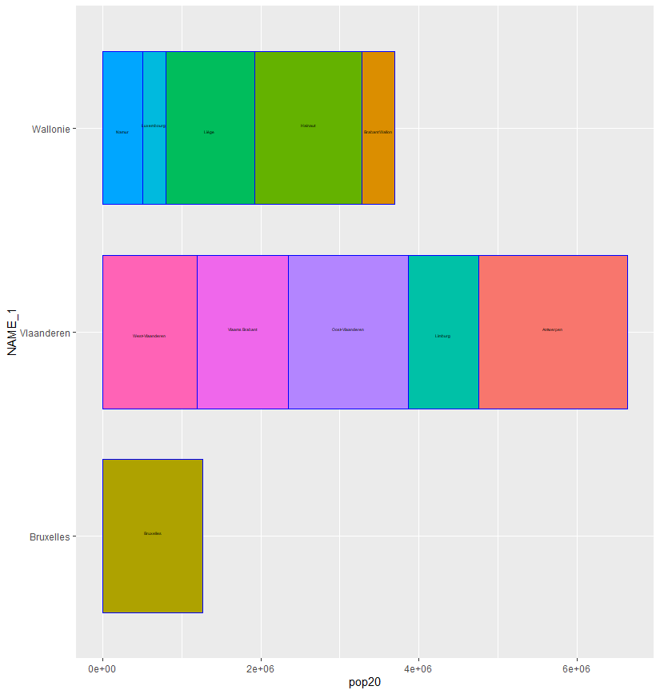

# Project 4

## Part 1 - Stretch Goals 1 and 2

This picture shows Belgium, it's provinces, and subprovinces. I tried to get the minimum to be purple or blue but it never did so I assume that the minimum was too low or such. 

## Stretch Goal 3

This gif shows a 3d image of the population sizes in Belgium, allowing one to get a accurate comparison between divisions. As one can see, most of the poppulations don't vary too much, as there is no blue on the chart. 

If the gif doesn't show up (it isn't for me but I have the code in place) let me know and I can personally send it.)

## Part 2 Individual Deliverable 

This plot actually shows my adm2, as adm1 for belgium only has 3 counties which I felt wasn't very interesting. My plot came out good, I didn't need to make any modifications to the original code and everything turned out fine. This plot was produced by first creating plots for both the density of Belgium and it's population, and then combinging the two plots into a single one. 

## Part 2 Stretch Goal 1

This graph shows why I decided to go with adm2 in the aforementioned individual deliverable, as this graph only has 3 counties which is what Belgium has, and more subcounties in those counties. But regardless 3 counties total seems very boring. 
