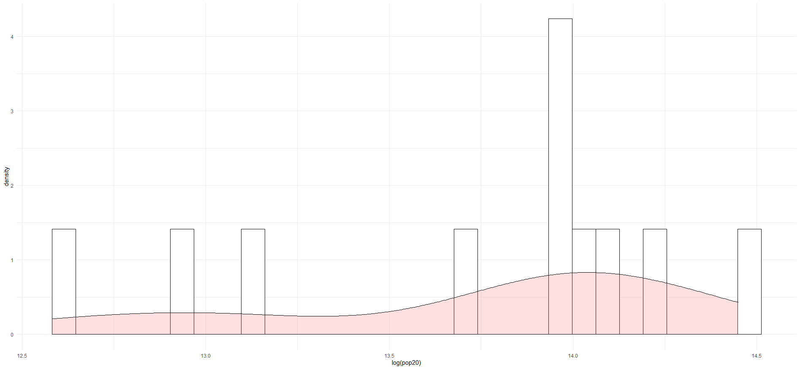
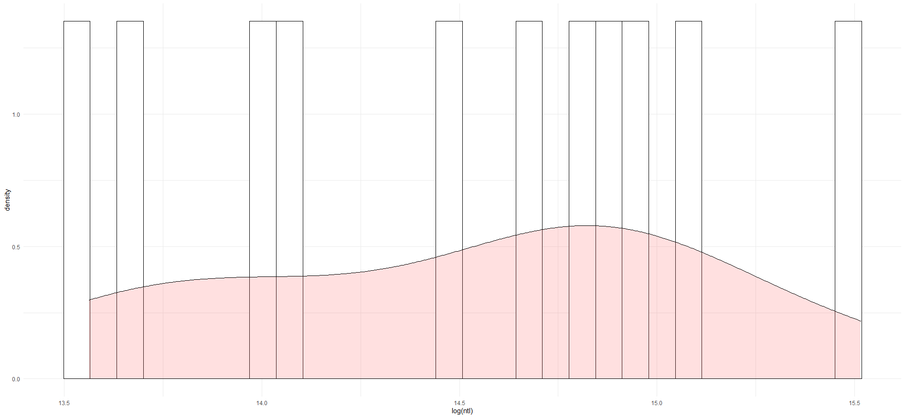

# Project 5

### Histogram of Population Density

This image shows a bar plot with the subdivisions of Belgium and its trend, shown by the line. There are large outliers followed by lacks in population which creates an interesting graph.

### Histogram of Night Time Light Density

This image shows a bar plot and a line graph trend of the night time lights in Belgium within each of its subdivisions. Just as the other one there are signifigant differences between each subdivision, which most likely means there are a few very populous areas in Belgium and a couple highly unpopulated areas in between. 
