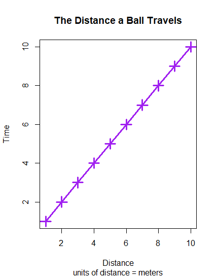

# The read me part of a page
Now you must read me

## Have you been gnomed?

### Now it's time for the infinite gif

### Maybe one more infinite gif?
.gif)
#### Ball Graph

This graph shows how far a ball travels in a matter of seconds. TO create this graph, one must fist creat a x and y variable with numbers from 1-10 using the 

  <h3 class="text-shadow-light">.x <- 1:10</h3>

x <- 1:10 and y <- 1:10 commands. Next, graph it using the plot(x,y) command. Then name the graph with the main = "..." command, the x Label with the xlab = "..." command, the y label with the ylab = "..." command, and then just change the line length,color, dot shape, and dot size to fit personal preference. 
