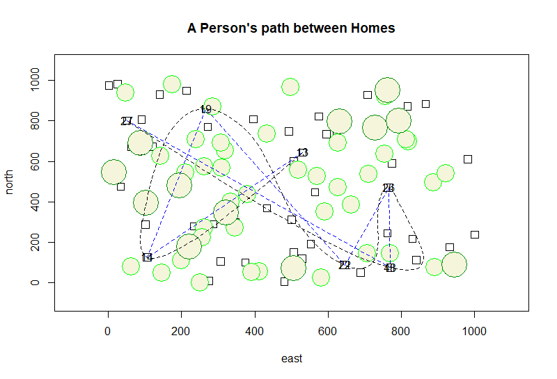

# A Person's Path Between Homes

This code is essentially the same as the code in the original graph - [Here.](RStudioGraph.md) However, The house count is increased to 50, the maximum x and y is set to 1000, sizes are increased, and there are also 7 path points instead of 3. For a more detailed walkthrough, see the previous assignments. 

Code: [Click Here](code1.md)

